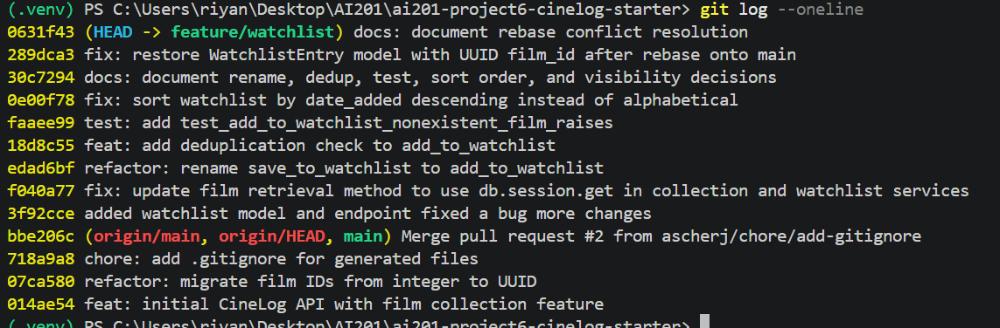

# PR Response Doc — CineLog Watchlist Feature

## AI Usage
I used Claude Code for three things:

1. **Comment 1:** searched the repo for every call site of
   `save_to_watchlist` before and after the rename, to confirm nothing was
   missed.

2. **Comment 6:** after the rebase showed no conflicts, I asked it to check
   the watchlist code against the new UUID models. It found that main's
   UUID migration had silently dropped `WatchlistEntry` from `models.py`
   during the rebase (no conflict, just a missing class). I verified this
   against the commit history myself, then had it help restore the class
   with a UUID `film_id`.

3. **Comments 4 and 5:** asked it to help draft my reasoning. I had it
   trim Comment 4 down to the core argument and tradeoff, and for Comment 5
   I used it to help state the one real case for alphabetical order so my
   response engaged with it. The positions are mine; AI helped write them
   up clearly.

## Comment 1 — Rename
**What I did:** I renamed `save_to_watchlist()` to `add_to_watchlist()` in
services/watchlist_service.py. Before changing anything, I searched the
whole repo for `save_to_watchlist` to find every place it was used. It only
showed up in two places: the function definition itself, and
routes/watchlist/watchlist.py, where it was imported and called inside
`add_film()`. I updated both of those.
**How I verified:** I searched the repo again for `save_to_watchlist` after
making the change, and got zero results, so I know nothing still points to
the old name. I also ran the full test suite (`pytest tests/ -v`) to make
sure nothing broke.

## Comment 2 — Deduplication
**What I did:** I added a duplicate check to `add_to_watchlist()` in
services/watchlist_service.py, based on how `add_to_collection()` already
does it in services/collection_service.py. I added a new
`AlreadyInWatchlistError` exception, the same way `AlreadyInCollectionError`
is set up. Then, before creating a new `WatchlistEntry`, I query for an
existing entry with the same `user_id` and `film_id`, and raise the new
error if one is found. I also updated the `/add` route in
routes/watchlist/watchlist.py to catch that error and return a 409 response,
just like routes/collection.py already does for collections.
**How I verified:** I walked through the code by hand and compared it
step by step with `add_to_collection()` to make sure the duplicate check
happens before the database insert, not after, so a duplicate row can never
get saved. I also ran `pytest tests/ -v` to confirm the existing tests still
pass with this change in place.

## Comment 3 — Missing test
**What I did:** I created tests/test_watchlist.py using
tests/test_collection.py as a template. I copied the same `app`,
`sample_user`, and `sample_film` fixtures, then wrote
`test_add_to_watchlist_nonexistent_film_raises` as the watchlist version of
`test_add_to_collection_nonexistent_film_raises`. It follows the same setup
and uses the same `pytest.raises(...)` style, just calling
`add_to_watchlist()` instead and checking for `FilmNotFoundError`. The one
difference is that `Film.id` is a plain integer, not a UUID like `User` and
`CollectionEntry` use, so I used a fake integer id (`999999999`) instead of
a fake UUID string.
**How I verified:** I ran `pytest tests/test_watchlist.py -v` and confirmed
the new test passes, then ran `pytest tests/ -v` to make sure the full
suite, including the existing collection tests, still passes.

## Comment 4 — Default visibility
**My position:** I think `public=True` is the right default for
`WatchlistEntry`, and I would keep it as is.

**Reasoning:** A watchlist is only useful as a social feature if other
people actually see it. If new entries default to private, most users will
never go find the setting and flip it, since visibility toggles are exactly
the kind of thing people forget about once they've added a film and moved
on. That means a private default quietly turns watchlists into a
solo-only feature for almost everyone, even though the whole point of
having a `public` flag is to let people share what they want to watch,
compare lists with friends, and discover films through other users. I'm
optimizing for that low-friction sharing behavior: add a film, it's visible,
no extra step required. That matches how the collection feature already
behaves, and keeping the two consistent means users don't have to learn two
different mental models for "have watched" versus "want to watch."

**Tradeoff acknowledged:** The real cost is privacy by default. A watchlist
can reveal more about someone than a collection of films they've already
watched. It can expose in-progress, half-formed, or even embarrassing
choices (a guilty-pleasure pick, something added on a whim, a film tied to
a personal situation someone might not want public) before the person has
decided whether they actually want to share it. With `public=True`, that
exposure happens automatically, by default, without the user actively
choosing it. Someone who cares about privacy has to notice the setting and
turn it off after the fact, rather than opting in when they're ready. I'm
accepting that risk in exchange for the feature actually getting used
socially, but if user feedback showed people were regularly caught off
guard by this, that would be a real signal to revisit the default.

## Comment 5 — Sort order
**My position:** I agree, and changed `get_watchlist()` to sort by
`date_added` descending instead of alphabetical by title.

**Reasoning:** A watchlist is a "what's next" list, not a reference list
you look something up in. When you open it, you're usually checking what
you just added or picking your next watch, not searching for a specific
title by name, so recency is the more useful default order. It also makes
the watchlist consistent with `get_collection()`, which already sorts by
`date_added` descending. Having the two features use different sort
conventions would be a small but real inconsistency for anyone using both.

**Engagement with reviewer's point:** The maintainer's reasoning was that
most users want to see what they added recently, and I think that's right,
especially since a watchlist keeps growing over time and alphabetical order
would bury a film someone just added in the middle of the list. The one
case alphabetical order wins is if a user has a long watchlist and wants to
check whether a specific film is already on it. But that's a lookup problem,
better solved by search or filtering than by the default sort order, and
it's a less common action than "what should I watch next." So I don't think
it's a strong enough case to keep alphabetical as the default. I made the
change rather than just agreeing in words.

## Comment 6 — Rebase
**What conflicted:** When I ran `git fetch origin` and `git rebase
origin/main`, the first thing that stopped me wasn't a real conflict, it
was an untracked `.gitignore` file on my machine that would have been
overwritten by the one already committed on main. I removed my local copy
since main's version already covered the same things plus a bit more.

After that, the rebase itself finished without showing any conflict
markers, but that turned out to be misleading. Main had a commit that
migrated `Film.id` and `CollectionEntry.film_id` from plain integers to
UUID strings, and rewrote models.py to match. That commit came from before
the watchlist feature existed on main, so it never included
`WatchlistEntry` at all. Since none of my own commits had touched
models.py, git didn't see any changes on my side to conflict with, so it
just quietly kept main's version of the file, which meant `WatchlistEntry`
disappeared from the codebase completely. No error, no conflict markers,
just a missing class.

**How I resolved it:** I added `WatchlistEntry` back into models.py, using
`db.String(36)` for `film_id` so it matches the new UUID style used by
`Film.id` and `CollectionEntry.film_id`, instead of the old integer column.
Then I went through the watchlist code and tests and cleaned up anything
still written as if `film_id` were an integer: the docstring in
`add_to_watchlist()`, the example request body in the route file, and the
fake film id used in `test_watchlist.py`, which I changed from a fake
integer to a fake UUID string.

**How I verified no conflict remains:** I ran `pytest tests/ -v` and all
five tests passed, including the new watchlist test. I also checked
`git log --oneline --merges origin/main..HEAD`, which came back empty,
confirming the rebase didn't add any merge commits and my branch history
is still a straight line on top of main.

## PR Description
<!-- Written at the end — feature overview, design decisions, manual testing steps -->

### Design decision: watchlist entries default to `public=True`

This is deliberate, not inherited. Watchlists are only a social feature if
entries are visible by default, since most users never go flip a
visibility toggle after the fact. I'm optimizing for low-friction sharing,
and keeping it consistent with `CollectionEntry`'s existing default.

Tradeoff: a watchlist can expose more than a "watched" collection (unfinished
or embarrassing picks), and with `public=True` that exposure happens before
the user opts in. If that causes real user complaints, we should revisit
the default or prompt for visibility at add-time.

